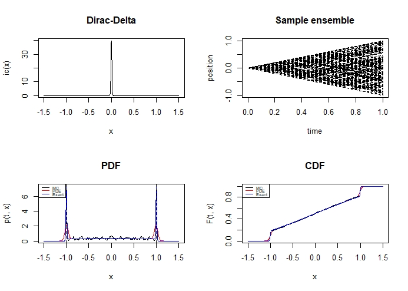

# telegrapher

<!-- badges: start -->
<!-- badges: end -->

The goal of telegrapher is to provide functions for solving the telegrapher PDE and studying the behavior of its solution as well as the associated telegraph or Kac process.

## Installation

You can install the latest version of the package using devtools:

``` r
devtools::install_github("shill1729/telegrapher")
```

## Example

Here is a basic overview of the output from the functions available. They are all called in telegraph_model internally but are exported and can be called individually.

``` r
library(telegrapher)
# Formal analog of Fokker Planck in one dimensional Minkowski space
# Time intevral and initial point
tt <- 0.5
x0 <- 5
# Default numeric parameters are used.
w <- telegraph_model(x0, tt)
print(w)
```

The above code will produce a lower resolution version of this, but will run relatively quickly for the purpose of a demo.



